# QuizApp - mobile quiz app 

A mobile quiz applitacion that allows user to create and solve quizzes, as well as form groups and send quizzes using an extensive community
card. An application created using Android Studio (language: Kotlin) with an emulator with Android 11.0 installed and PostgreSQL for data storage.

**For more details I can share my full diploma thesis**

**The application uses the Polish language pack - to change the language, you need to translate the file  \app\src\main\res\values\strings.xml**

Screenshots below will be described in the future :v

## SignUp & SignIn

  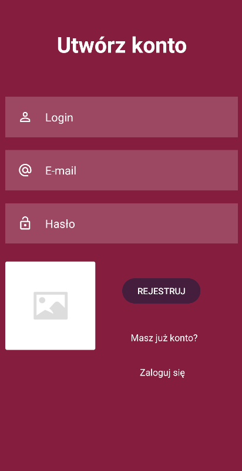
   

## Main page & menu side bar

  
  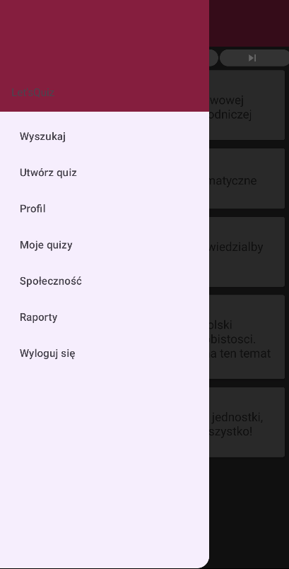 

## Quiz title page & creating questions

  
   

## Quiz title page view (author/ user)

  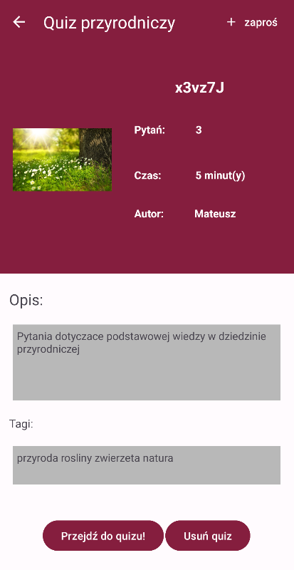
  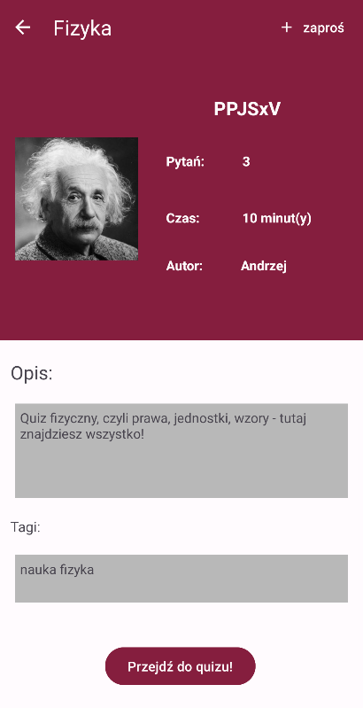 

## Quiz solving view (author/ user)

  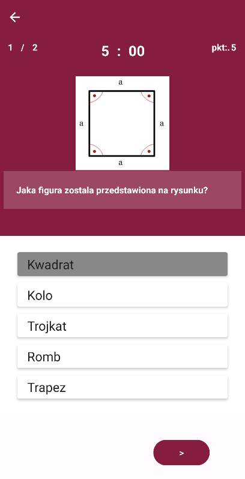
   

## Quiz summary view (author/ user)

  
  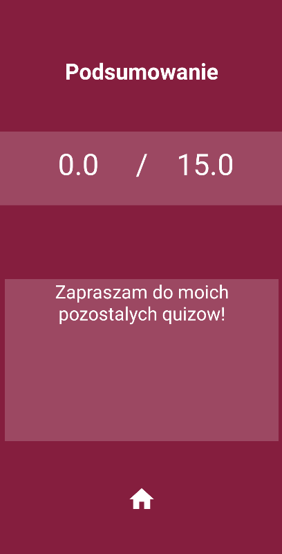 

## User profile (currently logged/ friend)

  
   

## Community

  
  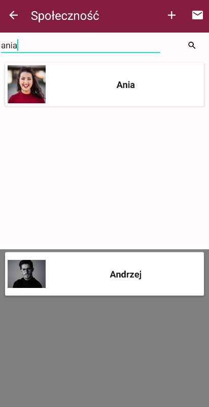 

## Invitations

  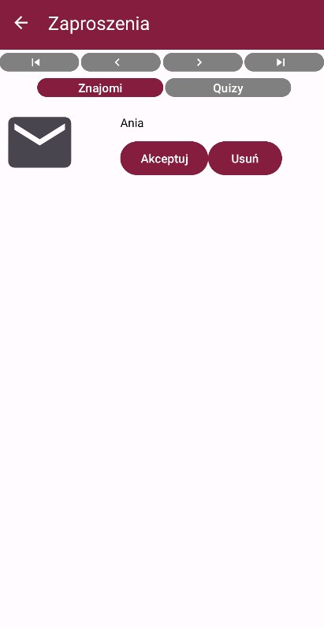
  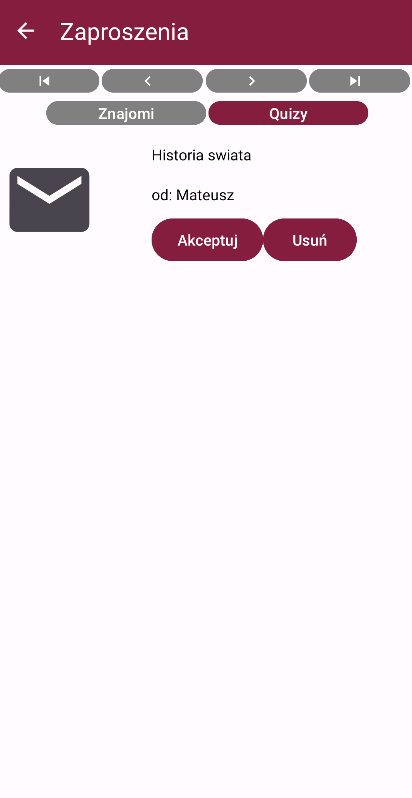 

## Search engine

  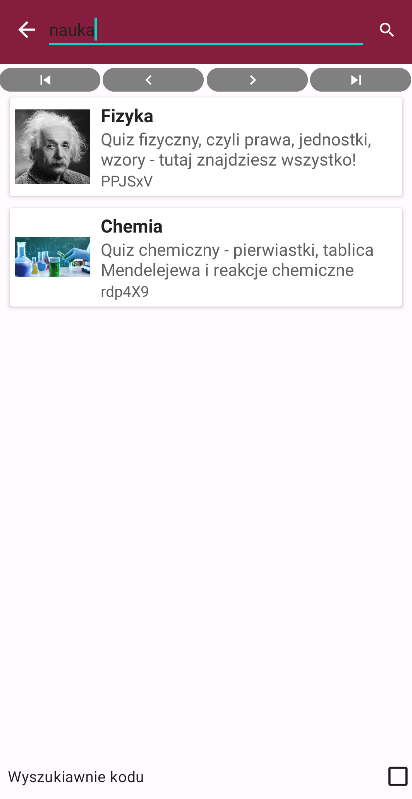

## Reports

  
  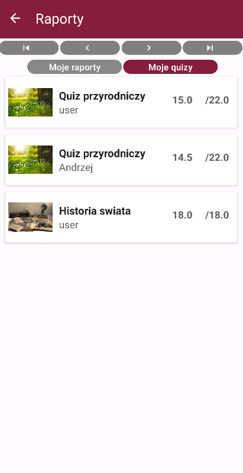 

## Contributors & Contrubutions

**Mateusz Motyl - backend (app functionality)**

Witold Gliwa - backend (database)

Jan Dołkowski - frontend
